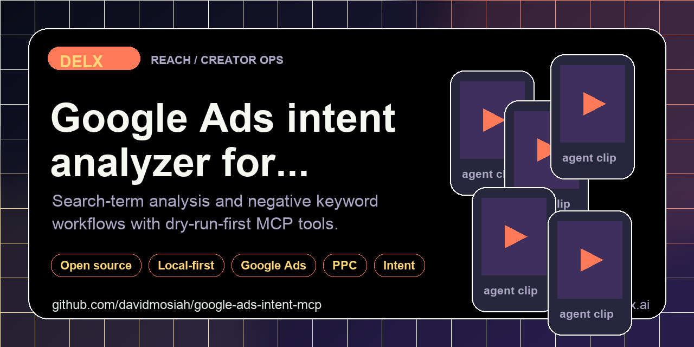

<!-- delx header v2 -->
<h1 align="center">Google Ads Intent MCP</h1>

<div align="center">
  
</div>

<h3 align="center">
  Dry-run-first Google Ads search-term intent analyzer + negative-keyword MCP for agents.<br>Look at search terms safely before spending budget.
</h3>

<p align="center">
  <a href="https://www.npmjs.com/package/google-ads-intent-mcp"></a>
  <a href="https://www.npmjs.com/package/google-ads-intent-mcp"></a>
  <a href="LICENSE"></a>
  <a href="https://modelcontextprotocol.io"></a>
</p>

<p align="center">
  <a href="https://github.com/davidmosiah/google-ads-intent-mcp/stargazers"></a>
  <a href="https://github.com/davidmosiah/google-ads-intent-mcp/actions/workflows/ci.yml"></a>
  <a href="https://github.com/davidmosiah"></a>
  <a href="https://github.com/davidmosiah/google-ads-intent-mcp"></a>
</p>

<p align="center"><code>mcp-name: io.github.davidmosiah/google-ads-intent-mcp</code></p>

> ⭐ **If this agent-first tool helps your workflow, please star the repo.** Stars make this tooling easier for other builders to discover and help Delx keep shipping open infrastructure.<br>
> 🧱 Part of the [Delx agent stack](https://github.com/davidmosiah) &mdash; 15 open-source MCP servers across **body, reach and coordination**.

---

<!-- /delx header v2 -->

Dry-run-first Google Ads search-term intent analyzer for agents. It helps Codex, Claude, Cursor, Hermes, OpenClaw and other MCP clients classify search terms, protect buyer intent and draft negative-keyword plans from CSV exports before any live account change.

Use it when an agent needs to reduce wasted spend without accidentally excluding buyer-intent queries.

## Why It Exists

Google Ads cleanup is risky when agents act directly on accounts. This package makes the safe path the default:

- analyze exported search-term CSVs locally
- classify waste, buyer, research and competitor intent
- draft negative-keyword plans without applying them
- expose `manifest`, `connection_status` and `privacy_audit` before action tools
- keep live mutation out of v0.1

## Install

```bash
pipx install google-ads-intent-mcp
```

With MCP support:

```bash
pipx install "google-ads-intent-mcp[mcp]"
```

Published on PyPI: [`google-ads-intent-mcp`](https://pypi.org/project/google-ads-intent-mcp/). Release automation uses PyPI Trusted Publishing, so GitHub Actions can publish future versions without long-lived PyPI tokens. See [docs/pypi-publishing.md](docs/pypi-publishing.md).

## CLI

```bash
google-ads-intent manifest --client codex
google-ads-intent doctor
google-ads-intent privacy-audit
google-ads-intent classify "free robux generator no verification"
google-ads-intent analyze-csv --csv examples/search_terms.csv
google-ads-intent plan-negatives --csv examples/search_terms.csv
```

### Intent classification

The classifier is a deterministic, dependency-free heuristic with broad,
cross-vertical signal coverage (ecommerce, B2B/SaaS, local services, health,
finance, education and more) — not just gaming traffic. It sorts each search
term into `waste`, `buyer`, `research` or `competitor` intent and protects
converting queries from being flagged as negatives.

An **optional** LLM/embeddings-backed refinement path is available and is
**off by default**. It requires no extra dependencies or API keys for normal
use, and always falls back to the heuristic when no backend is configured:

```bash
# Opt in via flag (falls back to the heuristic if nothing is configured)
google-ads-intent --llm classify "crm software pricing"

# Or via environment variable
GOOGLE_ADS_INTENT_LLM=1 google-ads-intent analyze-csv --csv export.csv
```

To actually call a backend, set `OPENAI_API_KEY` (and optionally
`GOOGLE_ADS_INTENT_LLM_MODEL`, default `gpt-4o-mini`) and install the `openai`
package. Without those, `--llm` is a no-op that keeps the heuristic result.
Each classification reports which path produced it via a `source`
(`heuristic` or `llm`) field.

## MCP

```bash
google-ads-intent-mcp
```

Hermes-style config:

```yaml
mcp_servers:
  google_ads_intent:
    command: google-ads-intent-mcp
    args: []
    sampling:
      enabled: false
```

Recommended first calls:

1. `google_ads_connection_status`
2. `google_ads_privacy_audit`
3. `google_ads_analyze_search_terms`
4. `google_ads_build_negative_plan`

## Agent Surfaces

| Tool | Purpose |
|---|---|
| `google_ads_agent_manifest` | Install/runtime guidance for agent clients |
| `google_ads_connection_status` | CSV/API readiness without credentials |
| `google_ads_privacy_audit` | Dry-run, account and export boundaries |
| `google_ads_classify_search_term` | Single-query intent classification |
| `google_ads_analyze_search_terms` | Batch CSV-style analysis |
| `google_ads_build_negative_plan` | Dry-run negative keyword plan |

## Copy-Paste Agent Prompt

```text
Use google-ads-intent-mcp. First call google_ads_connection_status and google_ads_privacy_audit.
Analyze the search terms, protect buyer/conversion queries, and return a dry-run negative plan only.
```

## CSV Format

The parser accepts common exported columns such as:

- `search_term`, `Search term`, `Query`
- `cost`, `Cost`, `cost_micros`
- `clicks`, `Clicks`
- `conversions`, `Conversions`, `Conv.`
- `impressions`, `Impr.`, `Impressions`

## Safety Model

- CSV analysis is local.
- Negative plans are dry-run only.
- Buyer/conversion terms are protected from automatic exclusion.
- OAuth tokens, developer tokens and account identifiers should stay in local environment/config files.

## Development

```bash
python3 -m venv .venv
. .venv/bin/activate
pip install -e ".[dev]"
pytest
python -m compileall -q src
```

---

## 📧 Contact & Support

- 📨 **support@delx.ai** — general questions, integration help, partnerships
- 🐛 **Bug reports / feature requests** — [GitHub Issues](https://github.com/davidmosiah/google-ads-intent-mcp/issues)
- 🐦 **Updates** — [@delx369](https://x.com/delx369) on X
- 🌐 **Site** — [wellness.delx.ai](https://wellness.delx.ai)
